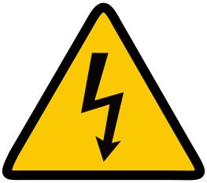
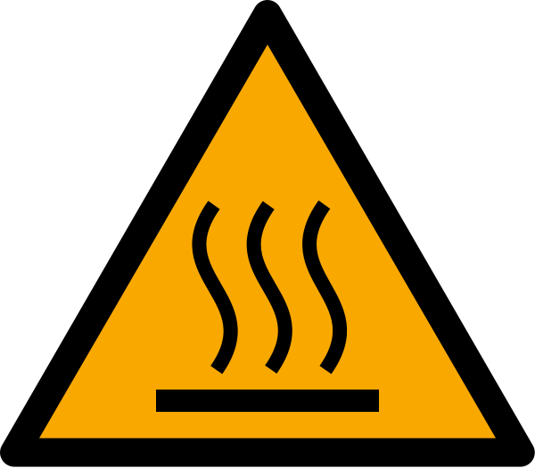
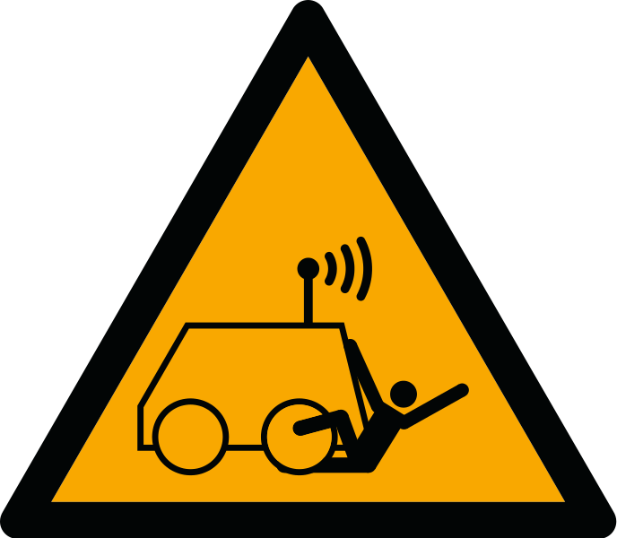
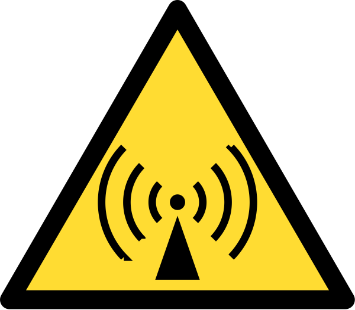

# Ground Control Station - Button Mapping Documentation

## Overview

This document provides a comprehensive mapping of all buttons and switches on the Ground Control Station (GCS) bottom panel, including their specific functions and the HID commands sent to the Raspberry Pi.

## System Architecture

- **Microcontroller**: STM32F411CE (BlackPill board)
- **Communication Protocol**: USB HID (Human Interface Device)
- **Command Type**: Function key presses (F13-F22)
- **Safety System**: Key switch lock/unlock with confirmation system

## Safety Features

### System Lock/Unlock

- **Key Switch (PINIO_KEY)**: Controls system lock state
  - **Locked Position**: All button functions disabled, LEDs show red
  - **Unlocked Position**: Enables button functionality if switches are in safe position
  - **Confirmation System**: All switches must be in LOW position when unlocking for full functionality

### Switch State Validation

- System checks all switches are in LOW position when unlocking
- If switches are not in safe position, functionality remains disabled
- Safety interlock prevents accidental activation

## Button Mapping

### Standard Control Buttons

#### SW0 - Function Button 1

- **Pin**: PINIO_SW0
- **Type**: Momentary switch
- **HID Command**: `KEY_F13`
- **Function**: General purpose control function
- **Icon**:  - Return to Home
- **LED Behavior**:
  - ON (pressed): Green/Blue color
  - OFF (released): Red/dimmed color
- **Safety**: Only active when system unlocked and confirmed

#### SW1 - Function Button 2

- **Pin**: PINIO_SW1
- **Type**: Momentary switch
- **HID Command**: `KEY_F14`
- **Function**: General purpose control function
- **Icon**:  - Mission Start/Resume
- **LED Behavior**:
  - ON (pressed): Green/Blue color
  - OFF (released): Red/dimmed color
- **Safety**: Only active when system unlocked and confirmed

#### SW2 - Function Button 3

- **Pin**: PINIO_SW2
- **Type**: Momentary switch
- **HID Command**: `KEY_F15`
- **Function**: General purpose control function
- **Icon**:  - Mission Stop/Pause
- **LED Behavior**:
  - ON (pressed): Green/Blue color
  - OFF (released): Red/dimmed color
- **Safety**: Only active when system unlocked and confirmed

#### SW3 - Toggle Function

- **Pin**: PINIO_SW3
- **Type**: Toggle switch (maintains state)
- **HID Command**: `KEY_F16`
- **Function**: Persistent state control function
- **Icon**:  - GPS/Navigation Mode Toggle
- **LED Behavior**:
  - ON (toggled active): Green/Blue color
  - OFF (toggled inactive): Red/dimmed color
- **Special Features**:
  - Uses static boolean variable to maintain toggle state
  - State persists until manually toggled again
- **Safety**: Only active when system unlocked and confirmed

#### SW4 - Function Button 5

- **Pin**: PINIO_SW4
- **Type**: Momentary switch
- **HID Command**: `KEY_F17`
- **Function**: General purpose control function
- **Icon**:  - Previous Waypoint/Function
- **LED Behavior**:
  - ON (pressed): Green/Blue color
  - OFF (released): Red/dimmed color
- **Safety**: Only active when system unlocked and confirmed

#### SW5 - Function Button 6

- **Pin**: PINIO_SW5
- **Type**: Momentary switch
- **HID Command**: `KEY_F18`
- **Function**: General purpose control function
- **Icon**:  - Next Waypoint/Function
- **LED Behavior**:
  - ON (pressed): Green/Blue color
  - OFF (released): Red/dimmed color
- **Safety**: Only active when system unlocked and confirmed

### Payload Control Section

#### SW6 - Payload Arm 1

- **Pin**: PINIO_SW6
- **Type**: Momentary switch
- **HID Command**: `KEY_F19`
- **Function**: First stage payload arming
- **Icon**:  - Payload Arm Stage 1
- **LED Behavior**:
  - ON (pressed): Green/Blue color
  - OFF (released): Red/dimmed color
- **Safety**:
  - Only active when system unlocked and confirmed
  - Required for SW8 payload operation functionality

#### SW7 - Payload Arm 2

- **Pin**: PINIO_SW7
- **Type**: Momentary switch
- **HID Command**: `KEY_F20`
- **Function**: Second stage payload arming
- **Icon**:  - Payload Arm Stage 2
- **LED Behavior**:
  - ON (pressed): Green/Blue color
  - OFF (released): Red/dimmed color
- **Safety**:
  - Only active when system unlocked and confirmed
  - Required for SW8 payload operation functionality

#### SW8 - Payload Operation

- **Pin**: PINIO_SW8
- **Type**: Momentary switch
- **HID Command**: `KEY_F21`
- **Function**: Primary payload operation control
- **Icon**:  - Payload Deploy/Release
- **LED Behavior**:
  - ON (pressed): Green/Blue color
  - OFF (released): Red/dimmed color
- **Safety Features**:
  - Only active when system unlocked and confirmed
  - **Payload Arming Check**: Requires both SW6 and SW7 to be pressed/armed before SW8 activation
  - Failsafe mechanism prevents accidental payload deployment

#### SW9 - Emergency/Secondary Function

- **Pin**: PINIO_SW9
- **Type**: Momentary switch
- **HID Command**: `KEY_F22`
- **Function**: Emergency or secondary payload function
- **Icon**:  - Camera Control/Secondary Function
- **LED Behavior**:
  - ON (pressed): Green/Blue color
  - OFF (released): Red/dimmed color
- **Safety**: Only active when system unlocked and confirmed

### System Control

#### Key Switch - System Lock/Unlock

- **Pin**: PINIO_KEY
- **Type**: Key switch (maintained position)
- **HID Command**: None (internal system control)
- **Function**: Master system enable/disable
- **Icon**:  - System Power/Lock Control
- **Behavior**:
  - **Key Inserted & Turned (HIGH)**:
    - Unlocks system
    - Checks all switches for safe LOW position
    - Enables full functionality if switches confirmed safe
    - Activates status LED (PC13)
  - **Key Removed or OFF (LOW)**:
    - Immediately locks system
    - Disables all button functionality
    - Sets all LEDs to locked state (red)
    - Deactivates status LED

## Technical Implementation

### HID Command Structure

```cpp
// Example button press implementation
if(state && !isLocked && isConfirmed) {
    BootKeyboard.write(KEY_F13);  // Send specific function key
}
```

### Safety Logic

```cpp
// System state variables
bool isLocked = true;        // Master lock state
bool isConfirmed = false;    // Switch position confirmation

// Unlock process
if(keyState) {
    isLocked = false;
    if(allSwitchesLow()) {
        isConfirmed = true;   // Enable full functionality
    } else {
        isConfirmed = false;  // Keep functionality disabled
    }
}
```

### Payload Arming Logic

```cpp
// SW8 payload operation requires SW6 and SW7 arming
if(sw8_pressed && sw6_armed && sw7_armed && !isLocked && isConfirmed) {
    BootKeyboard.write(KEY_F21);  // Execute payload operation
}
```

## LED Color Coding

- **Green/Blue**: Active/Armed/Pressed state
- **Red/Dimmed**: Inactive/Disarmed/Released state
- **Locked State**: All LEDs show red regardless of switch position

## Function Key Assignment Summary 

| Switch | Pin | Pin Value | Type | HID Command | Function | Icon |
|--------|-----|-----------|------|-------------|----------|------|
| SW0 | PINIO_SW0 | 8 | Momentary | KEY_F13 | Return to Home |  |
| SW1 | PINIO_SW1 | 9 | Momentary | KEY_F14 | Mission Start/Resume |  |
| SW2 | PINIO_SW2 | 10 | Momentary | KEY_F15 | Mission Stop/Pause |  |
| SW3 | PINIO_SW3 | 11 | Toggle | KEY_F16 | GPS/Navigation Mode |  |
| SW4 | PINIO_SW4 | 12 | Momentary | KEY_F17 | Previous Waypoint |  |
| SW5 | PINIO_SW5 | 13 | Momentary | KEY_F18 | Next Waypoint |  |
| SW6 | PINIO_SW6 | 14 | Momentary | KEY_F19 | Payload Arm Stage 1 |  |
| SW7 | PINIO_SW7 | 15 | Momentary | KEY_F20 | Payload Arm Stage 2 |  |
| SW8 | PINIO_SW8 | 6 | Momentary | KEY_F21 | Payload Deploy/Release |  |
| SW9 | PINIO_SW9 | 7 | Momentary | KEY_F22 | Camera Control/Secondary |  |
| Key | PINIO_KEY | 5 | Key Switch | None | System Lock/Unlock |  |

## Raspberry Pi Integration

The Raspberry Pi receives these function key presses as standard keyboard input and can map them to specific drone control functions, mission commands, or payload operations based on the flight control software configuration.

## Safety and Warning Icons

The control panel also includes several safety and warning symbols from the Icons directory:

-  **Electric Danger**: High voltage warning symbol
-  **ISO 7010 W017**: General warning symbol
-  **ISO 7010 W037**: Warning about injury from automated/remote-controlled vehicles
-  **Radio Waves Hazard**: RF radiation warning

## Failsafe Features

1. **Master Lock**: Key switch provides hardware-level disable
2. **Switch Confirmation**: All switches must be in safe position when unlocking
3. **Payload Arming**: Dual-stage arming required for payload operations
4. **Visual Feedback**: LED states clearly indicate system status
5. **Immediate Lock**: System locks instantly when key is removed
